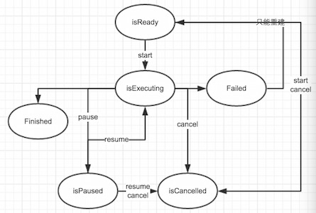

#	实现项目下载需求时遇过的那些坑

	`来自DeveloperLx的github`
---

###	导语

* 当前市面上的APP，凡有涉及到视频、期刊、或其它大型文件传输、浏览等用途的，添加下载或缓存至本地的功能以避免网速的限制及依赖，毫无疑问都将给用户带来更好的体验。而谈到下载技术，就又不得不牵扯到了断点续传，队列任务等老生常谈的问题。这不，本人当前的项目，就恰好遇到了这样的需求。然而在经过大量调研之后，本人竟无法找到一篇总结得很好的文档，对此进行全面的介绍；能够寻到的一些活跃度并不高的开源项目，却又不能恰如其分并抱之以信赖满足项目的需求。所以仔细斟酌后，不得不选择自己动手，丰衣足食。钻研的过程中遇到了不少坑、不少困难，有些个别的地方真是不用不知道，一用才知道是如此得蹩脚，难怪很少有人对此进行系统完整的介绍。现将本人在实现下载模块时所用到的技术总结如下，相信本文中所蕴涵的干货一定不会令费心阅读的你感到失望！

* 话休絮烦。首先，说下载就离不开网络请求。而当今iOS开发技术当中，最广泛使用的网络请求框架无疑要属AFNetworking。经过对其进行简单研究后，你就会寻到最适合用来完成下载这件“小事”的组件，叫做`AFHTTPRequestOperation`


**现假定我们的需求是最常见，也是最能体现技术问题的一个，叫做：**

* 下载队列在某一时刻，最多仅能有一个下载任务处于正在下载的状态中！

---

###### -- 叙述的节奏似乎稍稍快了些

> 那就先来看下实现队列下载、断点续传等需求的关键示例代码吧!

```
	NSError * error = nil;

	// 创建下载队列
	NSOperationQueue * downloadOperationQueue = [[NSOperationQueue alloc]init];
	//	规定operationQueue中，最大可以同时执行的operation数量为1
    downloadOperationQueue.maxConcurrentOperationCount = 1;

	// 创建单个下载任务（访问已下载部分的文件，实现断点续传）
	NSMutableURLRequest * downloadRequest = [NSMutableURLRequest requestWithURL:[NSURL URLWithString:DOWNLOAD_URL_STRING]];
    [[NSURLCache sharedURLCache] removeCachedResponseForRequest:downloadRequest];
    
    AFHTTPRequestOperation * downloadOperation = [[AFHTTPRequestOperation alloc]initWithRequest:downloadRequest];
    
    unsigned long long downloadedPartFileSize = 0;
    
    if ([[NSFileManager defaultManager] fileExistsAtPath:DOWNLOADED_PART_FILE_PATH]) {
        
        NSDictionary * fileAttributes = [[NSFileManager defaultManager]attributesOfItemAtPath:DOWNLOADED_PART_FILE_PATH error:&error];
        downloadedPartFileSize = [fileAttributes fileSize];
        NSString * headerRangeFieldValue = [NSString stringWithFormat:@"bytes=%llu-", downloadedPartFileSize];
        [downloadRequest setValue:headerRangeFieldValue forHTTPHeaderField:@"Range"];
    }
    
    downloadOperation.outputStream = [NSOutputStream outputStreamToFileAtPath:DOWNLOADED_PART_FILE_PATH append:YES];
    
    [downloadOperation setDownloadProgressBlock:^(NSUInteger bytesRead, long long totalBytesRead, long long totalBytesExpectedToRead) {
        NSLog(@"%lld/%lld", totalBytesRead + downloadedPartFileSize, totalBytesExpectedToRead + downloadedPartFileSize);
    }];
    
    [downloadOperation setCompletionBlockWithSuccess:^(AFHTTPRequestOperation *operation, id responseObject) {
        NSLog(@"downloadOperation completion block invoked");
    } failure:^(AFHTTPRequestOperation *operation, NSError *error) {
        NSLog(@"downloadOperation failure block invoked");
    }];
    
    //	将单个下载任务加入到下载队列当中
    [downloadOperationQueue addOperation:downloadOperation];
    
    //	暂停某下载任务
    [downloadOperation pause];
    
    //	继续某下载任务
    [downloadOperation resume];
    
    //	取消某下载任务（同时应将其已下载部分的文件删除）
    [downloadOperation cancel];
    [[NSFileManager defaultManager] removeItemAtPath:DOWNLOADED_PART_FILE_PATH error:&error];
    
    //	取消全部下载任务
    [downloadOperationQueue cancelAllOperations];
    
    //	此外还有若干方法用以判断相应一见其名便知其义的状态...
    downloadOperation.isReady
    downloadOperation.isExecuting
    downloadOperation.isPaused
    downloadOperation.isCancelled
    downloadOperation.isFinished
    
    //	判断downloadOperation是否存在在downloadOperationQueue当中
    [downloadOperationQueue.operations containsObject:downloadOperation]
```    

* 以上代码创建了一个AFHTTPRequestOperation对象作为单个下载任务，并将其加入到*NSOperationQueue*中。仿照上例，我们可以创建多个AFHTTPRequestOperation对象并加入到*NSOperationQueue*中，即形成了下载队列

---

* 做到这里，你是不是认为已经没有神马技术问题啦？只要把operation一个个地添加到queue里, 下载任务就可以一个接一个地自动执行了！而如果我们将上一个operation暂停、取消，或是它自然地下载完成了，又或是它下载中途失败了，下一operation就会聪明地自动启动，继续其下载任务了！！？  

## 错！！！！

* 接下来笔者将要告诉你的，就是本文最最核心的`干货`，绝对颠覆你的想象！！

---
* 只要你亲手动手试一试，就会发现如下大跌眼球的惊恐现象！！


* 惊人事实 1： 对queue中前一个下载operation执行pause方法，下一个operation并不能自动启动进入正在执行的状态！！

* 惊人事实 2： 如果queue中前一个下载operation执行失败了（可用下载中途断网进行模拟），它将从queue中自动地被移除掉！！

* 惊人事实 3： 注意到代码里那个failure回调的block了没？它不仅仅将在operation执行失败的时候被调用，还会在operation被cancel的时候被调用！！所以对于神马叫做“operation的失败”，你要重新建立起你的世界观了！！

* 惊人事实 4： 如果对一个正处于pause状态的operation执行cancel会怎么样？答案是这个operation还保留在queue中！！并且仍然保持着pause状态！！仅有的一点变化，是它的isCancelled属性，变成了YES！！

* ......未完待续，本文要令你感到惊诧的，还有很多	    

> 由于这些问题间相互关系的错综复杂，为了清晰条理地予以说明，特将本人实验中所观察到operation的行为总结如下表。其中有悖于我们想象的结果，已用`彩色背景字体`标出

### 

Index | Description | isReady | isExecuting | isPaused | isCancelled | isFinished | in Queue | success block invoked | failure block invoked | 与预期不相符的事实 | 可能的解决方案 
:----------: | :-----------: | :----------: | :----------: | :----------: | :----------: | :----------: | :----------: | :----------: | :----------: | :----------: | :----------: |
1 | 加入queue前 | YES | | | | | | | | | |
2 | 加入queue后 | | YES | | | | YES | | | | |
3 | 自然结束后 | | | | | YES | | YES | | | |
4 | 正在下载时执行pause方法后 | | | YES | | | YES | | | | |
5 | 正在下载时执行cancel方法后 | | | | YES | ` YES`  | | | `YES` | 被标记finished；fail block被调用 | 不能仅凭fail block被调用判定某operation执行失败；必须同时判定isCancelled才是真正的失败，否则只是被人为地取消了 |
6 | 正在暂停时执行resume方法后 | | YES | | | | YES | | | | |
7 | 正在暂停时执行cancel方法后 | | | `YES` | YES | | `YES` | | | Paused状态未被取消；未能从queue中被移除 | 如想将暂停时的operation取消并从operationQueue中清除掉，必须首先执行[downloadOperation resume]后，再执行[downloadOperation cancel] |
8 | 中途意外失败后 | | | | | `YES` | | | YES | 被标记为finished；从queue中被移除 | 必须用另外的方式记录执行中途意外失败的downloadOperation以实现中途失败的下载任务断点续传 |
9 | 等待上一任务结束时 | YES | | | | | YES | | | | |
10 | 上一任务中途意外失败后 | | YES | | | | YES | | | | |
11 | 上一任务正在执行时被暂停后 | `YES` | | | | | YES | | | 上一operation被正在执行时被暂停后不能自动使下一operation开始执行 | 前一个operation被暂停后，必须手动启动下一operation |
12 | 上一任务正在执行时被取消后 | | YES | | | | YES | | | | |
13 | 上一任务正在暂停时被取消后 | `YES` | | | | | YES | | | 上一operation被正在暂停时被取消后不能自动使下一operation开始执行 | 前一个operation被暂停后，必须手动启动下一operation |
14 | 队列被执行cancelAllOperations | | | | YES | `YES` | | | `YES` | 被标记finished；fail block被调用 | 不能仅凭fail block被调用判定某operation执行失败；必须同时判定 isCancelled才是真正的失败，否则只是被人为地取消了 |

---

* 有木有感到*AFHTTPRequestOperation*和*NSOperationQueue*是个多么坑爹的东东？为何就不能像我们想象中一样用得舒爽？

* **原因就在于*AFHTTPRequestOperation*的父类*NSOperation*，在设计之处就不是为了下载的操作而生的！**人家开始就仅仅是用来处理多线程的啊！！所以造成了*AFNetworking*在扩展这个类的时候，可用的资源、接口等等就非常少。对于什么下载任务暂停/继续，下载中途失败等等情况，很多问题几乎就是没有办法理想地解决的，只好用*NSOperation*中仅有的几种状态予以并不贴切的表示。于是乎就出现了上表中种种诡异的情况

>	补充几点干货。然后告诉你一个本文之前偷偷误导了你的大坑！！

* 惊人事实 5：如果一个queue中有一个下载operation正在执行，此时对另一处在isReady状态的operation执行start方法会怎么样？你很可能会说：“没用的，因为之前设了queue.maxConcurrentOperationCount = 1嘛！” 可事实恰好相反，这个operation也会立刻被启动执行！！于是乎你不忍心看到的事情就出现了，这时queue将会有两个任务被同时执行！！maxConcurrentOperationCount完全失效了！！

* 惊人事实 6：承接上一点，如果此时另一条的状态不是isReady，而是isPaused暂停状态，你对其执行resume方法，此时会怎么样呢？哈哈，没错，你吸取了上一条的经验，终于猜对了！这个operation也会立刻启动被执行，不管当前的queue有没有另一个operation正在被执行！！从中我们就可以意识到，maxConcurrentOperationCount这个属性，只能管得自动启动每一operation时，先检查下是否正在执行的operation的数量已经超过那个数字了；可是如果你要手动start某一operation，对不起，这条限制半点都没有用处了......

* 惊人事实 7：从上表中我们可以看到，无论是一个operation自然地执行完毕，还是中途失败，还是被执行了cancel方法，都会被标记为isFinished，从operation中被移除掉，operation所认为的“完成”可完全不像我们想象中的那么狭义！问题来了，此时如果再对这个operation执行start方法会怎么样？对不起！没有任何用处！😭所以你如果想要让一个已失败的operation从断点处继续再开始执行下载该怎么办？不好意思，只好新建operation重新再来了......


######	基于实验我们又可以得出了这样的一张流程图：

* 

---
* 头痛、抓狂得很啊！！本人刚开始实现下载模块相关需求的时候，就被这些问题坑了个体无完肤。最后得出了本文最大的关键结论，也就是前面所说的“大坑”：

###	不能够使用NSOperationQueue来进行多下载任务的管理！！！

######	理由如下：

1.	你无法妥善地实现“队列中最多仅能有一个下载任务正在进行”这条产品经理臆测会让开发变简单的需求！！比方说，你让NSOperationQueue中一个operation暂停后，下一个任务并不会自动启动啊！有人说可以手动去start下一个operation，如果这个姑且算做可以接受，可是问题又来了：我们没有办法手动将一个operation置为isReady状态啊！！处于isReady状态的operation，要么是还未加入queue，要么是加入了还未轮到执行，但是它只要一执行，就再也回不到isReady的状态了！那我们要让暂停的operation恢复到等待下载状态该怎么搞？此时可能还有另一operation正在执行啊！！反之笔者搞了半天，是无能为力了

2.	下载是需要一定时间的过程，需要不停地向服务器进行请求，那么就永远避免不了因为网络等原因中途会失败的问题。可要命的是，一旦下载失败，operation就会毫不妥协地从queue中被移除掉啊！！你能在这时候让你的下载任务从UI界面上消失掉吗？显然大BOSS是不会允许你这么干的。有人说可以重建operation再加入到queue中，可那样你只能将operation插到队尾，列表顺序就被打乱了啊！！你去瞧瞧看，operationQueue.operations，那可只是一个**只读属性**啊！！

3.	......自己去体会吧，反正坑多的已经无力吐槽，再坚持下去也是枉费心思了。

---
* 不幸的事情来了。笔者最后只得放弃NSOperationQueue，使用古老原始的工具--NSMutableArray来进行多下载任务的管理。这样的话所有operation的启动、移除等操作都必须依靠手动来执行。这个办法虽然办法土了些，可是起码对于每个operation的控制权又重新回到了我们手里。有得必有失嘛！当能恰当地实现了项目需求的时候，这点牺牲也就算不上神马了

###### 在使用**AFHTTPRequestOperation**时我们还需要注意以下几点：

1.	对isReady状态的operation执行resume、pause、cancel等方法是没有任何用处的，所以为了确保执行正确，在对operation执行resume、pause、cancel前，都要首先执行[operation start]。（对已经start过的operation执行start不会造成任何影响）
2.	对处于isPaused的operation执行cancel方法是无法得到正确结果的，所以每次执行cancel方法前，都要先执行一下[operation resume]。 (同样对于正处于isExecuting状态的operation来说，执行resume方法也是不会造成任何影响的)
3.	对于下载模块这个纠结之处来说，本地持久化下载记录的相关数据也是必不可少的，理由如下：
```
  	a.	AFHTTPRequestOperation、NSMutableArray这些都是运行时的东西，一关掉app，这些东西自然也都消失得无影无踪了。我们能让下载记录就此消失得无影无踪么？NO！显然是不能接受的  
  	b.	我们下载得到的那个文件，可能是已下载完成的，可能是只下载了部分的；而只下载了部分这种的，又可能是下载中途暂停了的，失败的，被取消的等等情况。请问单凭这个文件如何判断它是属于哪种情况？而且这还不够，有些下载任务根本可能就还未生成相应的下载文件，app就已经被关了啊！你能就把这种的下载任务扔掉吗？显然是绝不可以的
	c.	不使用operationQueue我们同样无法手动将operation标记为队列等待的isReady状态，怎么办？只有将operation设定为paused，然后相应的数据记录标记为isReady状态好了（本人使用的是CoreData进行本地持久化存储）
	d.	......用operation外的数据模型记录下载任务的状态好处还有很多，但同时带来的同步更新问题也有很多，具体就留给大家自己去体会了！
```

---
*	以上就是本人总结下载模块实现时需要注意到的种种内容。当然各位大神如果有更好的方案提出，比如用本人掌握得还不够好的stream如何实现上述需求，本人也愿虚心听取以将此处完善得更好。欢迎直言批评与不吝赐教！！

###### 本人第一次写博，以前较懒全抛的是开源库。本文欢迎转载，但请务必标明出处！如果感觉本人总结的对于各位思路有所小小帮助的话，恳求赐星一颗！感激之情如滔滔江水向东流😄


---
续篇（<https://github.com/DeveloperLx/Dreamy_download_manage_solution>）
